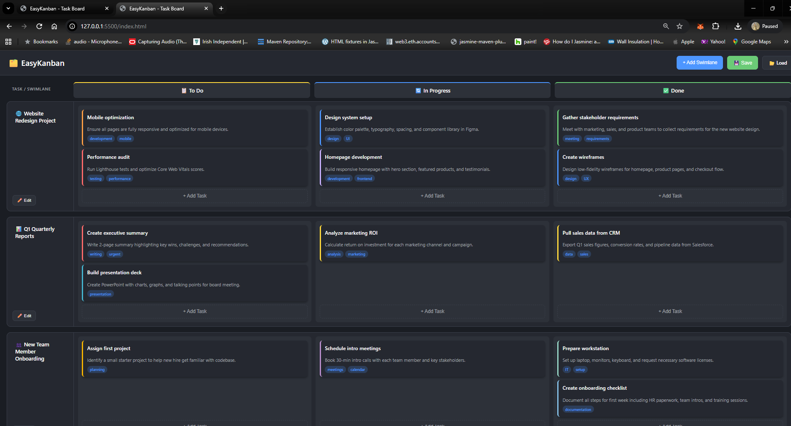

# 🗂️ EasyKanban

A simple, client-side Kanban board for managing work tasks. No server required - runs entirely in your browser with local file save/load functionality.




## ✨ Features

### Swimlanes (Horizontal)
- Create multiple swimlanes for overarching tasks or projects
- Edit or delete swimlanes as needed
- Organize related subtasks within each swimlane

### Columns (Vertical)
- **📋 To Do** - Tasks waiting to be started
- **🔄 In Progress** - Tasks currently being worked on
- **✅ Done** - Completed tasks

### Task Cards
- **Drag & Drop** - Move tasks between columns and swimlanes
- **Custom Colors** - 12 color options to categorize or prioritize tasks
- **Labels** - Add multiple tags to tasks for easy filtering
- **Titles & Descriptions** - Document task details

### Data Persistence
- **💾 Save** - Export your board to a JSON file
- **📂 Load** - Import a previously saved board from JSON

## 🚀 Getting Started

### Option 1: Direct File Open
Simply open `index.html` in any modern web browser.

### Option 2: Local Server
```bash
# Using Python
python -m http.server 8000

# Using Node.js
npx serve

# Using PHP
php -S localhost:8000
```
Then navigate to `http://localhost:8000`

## 📖 Usage

1. **Create a Swimlane** - Click "+ Add Swimlane" and enter a name for your overarching task/project
2. **Add Tasks** - Click "+ Add Task" in any column to create a subtask
3. **Edit Tasks** - Click the ✏️ button on any task to modify its title, description, color, or labels
4. **Move Tasks** - Drag and drop tasks between columns (To Do → In Progress → Done) or between swimlanes
5. **Save Your Work** - Click "💾 Save" to download your board as `easykanban-data.json`
6. **Load Previous Work** - Click "📂 Load" to restore a previously saved board

## 📁 Project Structure

```
easykanban/
├── index.html    # Main HTML structure
├── styles.css    # Dark theme styling
├── app.js        # Application logic
└── README.md     # This file
```

## 💾 Data Format

Board data is saved as JSON with the following structure:

```json
{
  "swimlanes": [
    {
      "id": "unique_id",
      "name": "Swimlane Name",
      "tasks": [
        {
          "id": "unique_id",
          "title": "Task Title",
          "description": "Task description",
          "status": "todo|inprogress|done",
          "color": "#hex_color",
          "labels": ["label1", "label2"]
        }
      ]
    }
  ]
}
```

## 🎨 Color Options

| Color | Hex Code |
|-------|----------|
| Yellow | `#ffd93d` |
| Green | `#6bcb77` |
| Blue | `#4d96ff` |
| Red | `#ff6b6b` |
| Purple | `#c9b1ff` |
| Orange | `#ff9f45` |
| Cyan | `#45b7d1` |
| Mint | `#98d8c8` |
| Gold | `#f7dc6f` |
| Violet | `#bb8fce` |
| Sky | `#85c1e9` |
| Amber | `#f8b500` |

## ⌨️ Keyboard Shortcuts

| Key | Action |
|-----|--------|
| `Esc` | Close any open modal |

## 🌐 Browser Support

Works on all modern browsers:
- Chrome
- Firefox
- Safari
- Edge

## 📄 License

See [LICENSE](LICENSE) file for details.
